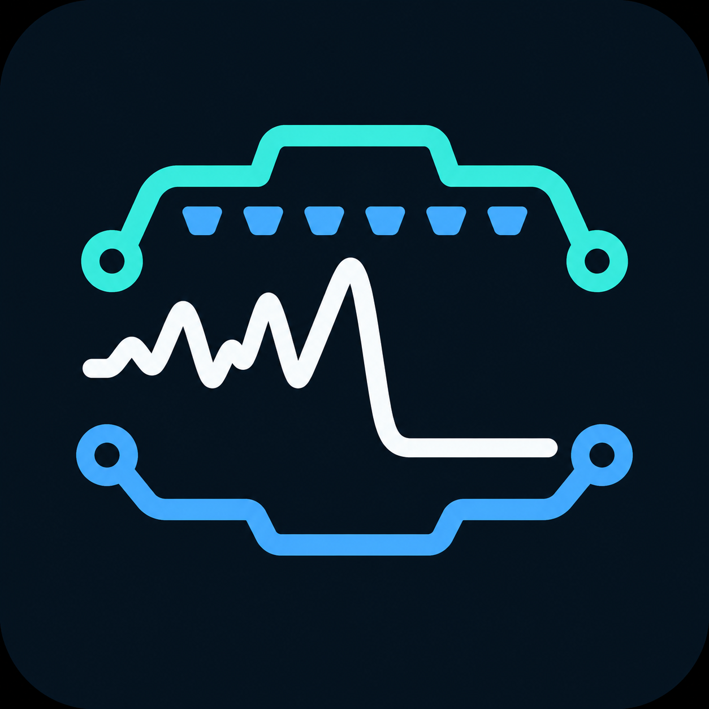
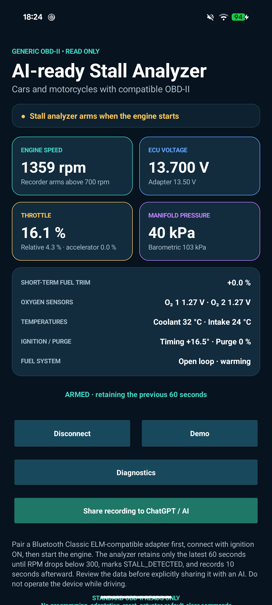
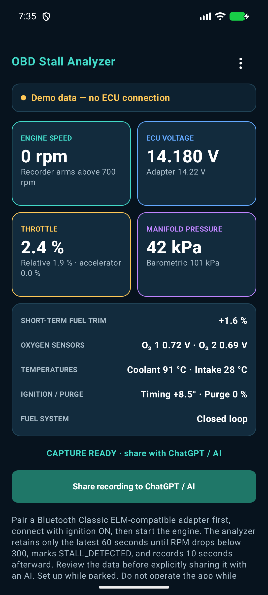

<p align="center">
  
</p>

<h1 align="center">OBD Stall Analyzer</h1>

> Capture the seconds around an engine stall and turn raw OBD-II telemetry into a report that is ready to inspect or share with an AI assistant.

OBD Stall Analyzer is a read-only Android app for cars and motorcycles with a compatible OBD-II adapter. It keeps a rolling window of live engine data, detects a stall from the RPM transition, and packages the event as a portable CSV-backed diagnostic report.

<p align="center">
  
  &nbsp;
  
  &nbsp;
  
</p>

<p align="center">
  <strong>Waiting</strong> &nbsp;•&nbsp; <strong>Armed</strong> &nbsp;•&nbsp; <strong>Capture ready</strong><br>
  <em>The demo reproduces the dashboard's complete stall-capture cycle.</em>
</p>

## Why use it?

- **Capture the useful moment.** Retains up to 60 seconds before a detected stall and 10 seconds after it.
- **See the engine state at a glance.** Monitor RPM, ECU voltage, throttle, manifold pressure, fuel trim, oxygen sensors, temperatures, timing, purge, and fuel-system state when the vehicle supports them.
- **Bring your own analysis tool.** Export a vehicle-neutral prompt and CSV through Android's standard share sheet.
- **Explore safely before connecting.** Use the built-in demo mode to preview the dashboard and capture flow without an ECU.
- **Keep control of the data.** Nothing is uploaded automatically; you choose if, when, and where a report is shared.

## How capture works

1. The recorder arms once engine speed reaches **700 RPM**.
2. A transition from at least **600 RPM** to below **300 RPM** creates a `STALL_DETECTED` marker.
3. The app preserves no more than **60 seconds before** the marker and records **10 seconds after** it.
4. Until a stall occurs, only the latest rolling 60-second window is retained. Only the newest event capture is kept in memory.

The app first discovers the Mode 01 PIDs advertised by the vehicle and requests only supported values. RPM is required for automatic event detection; the rest of the dashboard adapts to the available data.

## Get started

You will need:

- Android 8.0 (API 26) or newer
- A Bluetooth Classic SPP ELM327-compatible, OBDLink, or vLinker adapter
- A vehicle exposing standard OBD-II data

Then:

1. Pair the adapter in Android's Bluetooth settings.
2. Open OBD Stall Analyzer and tap **Connect adapter**.
3. Select the paired adapter, switch the ignition on, and start the engine.
4. Leave the app recording; after a stall, review the retained data.
5. Tap **Share recording to ChatGPT / AI** to choose an analysis destination.

BLE-only and Wi-Fi-only adapters are not currently supported. Automatic OBD-II protocol selection is enabled.

## Read-only by design

OBD Stall Analyzer requests diagnostic data only. It does not send programming, adaptation, reset, actuator-test, or fault-clear commands.

> **Safety:** Set up the app and adapter while parked. Do not operate a phone or diagnostic equipment while driving.

## Build from source

The project uses Java 17 and the Android SDK. From the repository root, run:

```sh
./gradlew :app:testDebugUnitTest :app:assembleDebug
```

The debug APK is generated at `app/build/outputs/apk/debug/app-debug.apk`.

## Privacy

Recordings remain on the device until you explicitly use Android's share sheet. Always review exported diagnostic data before sending it to a third party.

## License

Licensed under the [Apache License 2.0](LICENSE).
